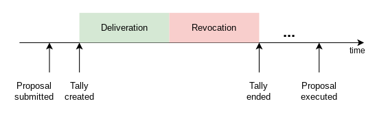
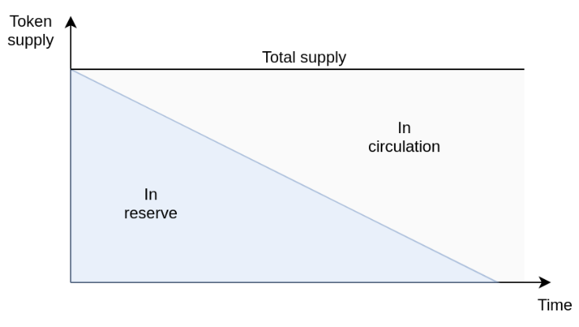

#  Humanity Unchained DAO

[Humanity Unchained DAO](https://humanityunchained.org) is a [Decentralized Autonomous Organization](https://en.wikipedia.org/wiki/Decentralized_autonomous_organization) running a [semi-direct democracy](https://en.wikipedia.org/wiki/Semi-direct_democracy) algorithm by which the *citizens* of the DAO can, either through a direct or a delegated vote, collectively interact with any smart contract. This allows the DAO to, for example, trade its own assets or upgrade its own smart contracts. The only prerequisite to join the DAO is proving to **be a human**. For that, citizens and delegates must first register in [Proof of Humanity](https://www.proofofhumanity.id). This is in contrast to other tokens, cryptocurrency protocols or fiat currencies, which are based on some form of *tokencracy* or *Proof of Wealth*.

In addition, the DAO owns a reserve of its native token (HUD), of which the DAO has full control so that the community can, for example, vote to forcibly transfer or lock HUD.

The DAO uses the HUD reserve to pay for the services that the DAO needs to function or for any other purpose the DAO approves so. These services are:

1. *Delegation*: Delegates are rewarded with HUD for casting their vote on transation proposals. Anyone can become a delegate. Citizens can optionally choose what delegate they trust their vote to, but citizens can **always** cast their own vote which overrides the delegates' or appoint another delegate at anytime.

2. *Execution*: The proposals are blockchain transactions to be executed if approved by the DAO. The DAO rewards with HUD to whoever is willing to pay the gas fees needed for the transaction's execution.

## Usage

A web frontend is deployed on https://app.humanityunchained.org. To use it, you need a Web3 wallet such as [Metamask](https://metamask.io) installed on your browser.

It is also possible to interact with the DAO by [running the frontend on your machine](frontend/README.md#runLocally) or [through the command line](smart_contracts/README.md#runTasks).

Humanity Unchained DAO's smart contracts currently run on the Polygon blockchain, mainnet for production, testnet Mumbai for test. **For a technical description, please check the [smart contract documentation](smart_contracts/README.md).**

We now describe Humanity Unchained DAO workflow from a user perspective.

**Step 1: A transaction proposal is submitted for review**

Any member of the DAO can submit a proposal to the DAO. This is done by submitting a transaction proposal to the `Wallet` contract. After that, members of the DAO can cast their votes on the proposal.

Currently, transaction proposals can only be submitted [through the command line](smart_contracts/README.md#runTasks).

**Step 2: The community votes on the transaction proposal**

The DAO has a limited number of *seats*, which are occupied by the delegates who have been appointed by the largest number of citizens. The *voting power* of a seated delegate is proportional to the number of citizens that appointed him/her. For simplicity, the rule *1-human-1-vote* is applied.

The voting process is divided into two phases: *deliveration* and *revocation*. Delegates cannot cast votes during the revocation period, **only citizens**. This guarantees citizens the chance to push back any decision from the delegates.

Seated delegates are paid a number of tokens proportional to their *voting power*. This creates an incentive for delegates to compete for citizens’ trust.

Example:
|||
--- | --- |
|Number of citizens|10
|Number of delegates|3
|Number of seats|2
|Delegates with seat|A, B
|Number of appointments of delegate A|5
|Number of appointments of delegate B|3
|Number of appointments of delegate C|2
|Total delegation reward token rate|100 HUD/sec
|Delegate A reward|100*5/10 = 50 HUD/sec
|Delegate B reward|100*3/10 = 30 HUD/sec

**Step 3: The transaction is approved and executed**

If the final result of the voting is `Approved`, the transaction can now be executed. The `Assembly` contract implements an automatic pricing algorithm that pays an increasing number of HUD tokens over time to anyone willing to bear the transaction costs. The number of HUD is determined by the formula 2^(number of seconds passed since approval).

Example:
|||
--- | --- |
|Number of blocks passed since approval|30
|Average block duration|2 sec
|Number of seconds passed since approval|30*2 = 60 sec
|Reward|1.15292150460685E+018 ~= 1.15 HUD

### Token

The total supply of HUD is fixed. The DAO owns a reserve of HUD tokens which are initially not in circulation. As time passes, the DAO will be spending the tokens from the reserve to pay for delegation, execution and referral rewards, or for any other purposes the DAO decides so.

##  Community

Discourse: https://forum.humanityunchained.org

Telegram: https://t.me/humanityunchaineddao

Twitter: https://twitter.com/UnchainedDAO

## License

Humanity Unchained DAO is released under the [MIT License](LICENSE).

## Disclaimers

1. This project is for experimental purposes only. In no event shall the creators or members of the DAO be liable for any claim, damages or other liability, whether in an action of contract, tort or otherwise, arising from, our of or in connection with this project.

2. Nothing contained in this project should be considered financial or investment advice.

3. HUD token holders must be warned that their HUD tokens can be locked or confiscated if the DAO approves so through a democratic voting.
