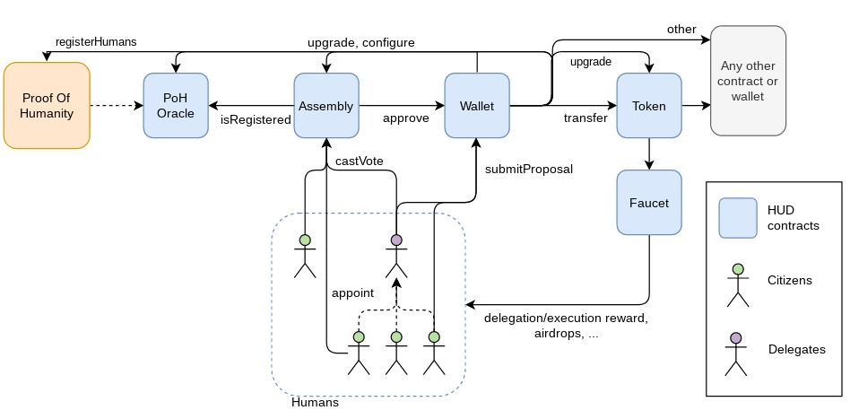
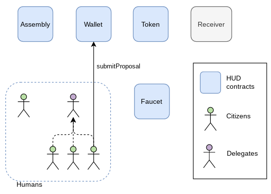
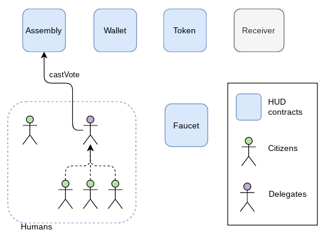
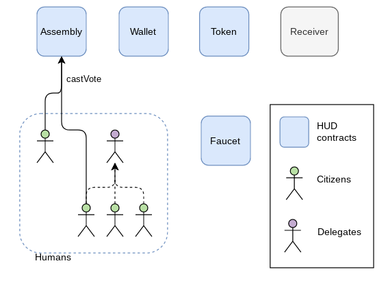
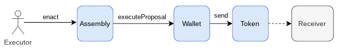
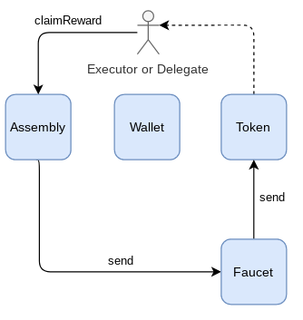
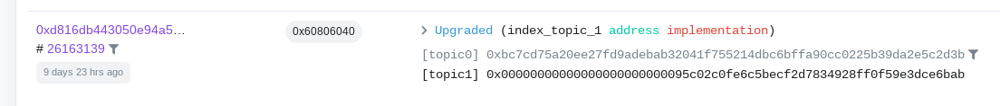

Humanity Unchained DAO smart contracts
=====

# Description

Humanity Unchained DAO's smart contract architecture consists of the following smart contracts:

|Contract|Description|
--- | --- |
|Proof of Humanity Oracle|Contains a copy of the sybil-proof list of addresses from the official Proof of Humanity contract on the Ethereum mainnet. The updating process requires the `DAO`'s approval itself.
|Assembly|Handles the citizen and delegate registration, creation of tallies, voting, etc.
|Wallet|It supports any asset. It is governed by the `Assembly`, which means that assets can be transferred out only under the `Assembly`'s approval through a voting process. It also stores a list of proposed transactions whose execution is to be approved (or rejected) by the `Assembly`.
|Token|An ERC777-compliant implementation of the HUD token. The `Assembly` can approve transaction executions to call the `Token` contract functions via the `Wallet` contract, just like for any other contract. The `Token` contract enables the DAO to lock and forcibly transfer HUD.
|Faucet|Serves as convenient *pocket money* recipient for automated transactions of small amounts of HUD without requiring a DAO's voting.



The voting and execution workflow is as follows:

**Step 1: A transaction proposal is submitted for review**

Any member of the DAO can submit a proposal to the DAO. This is done by submitting a transaction proposal to the `Wallet` contract. After that, members of the DAO can cast their votes on the proposal.

Currently, transaction proposals can only be submitted [through the command line](#runTasks).



**Step 2: The community votes on the transaction proposal**

The voting process is divided into two phases: *deliveration* and *revocation*. Delegates cannot cast votes during the revocation period, **only citizens**. This guarantees citizens the chance to push back any decision from the delegates.





**Step 3: The transaction is approved and executed**

If the final result of the voting is `Approved`, the transaction can now be executed.



# Setting environment

The following Solidity smart contracts have been developed on a Debian-based operating system with the following `node.js` and `yarn` versions:

```console
$ node --version
v12.22.5
$ yarn --version
1.22.17
```

To start with, clone this repo and run `yarn` to install the the project dependencies:

```console
$ git clone https://github.com/hhh01398/hud
$ cd hud/backend
$ yarn
```

# Run tests

Simply run:

```console
$ yarn test
```


# <a name="runTasks"></a> Tasks

A number of commands are executable via command line as Hardhat tasks, instead of or complementary to the frontend. These operations are typically not to be performed by `citizens` but rather by `delegates` or arbitrageurs. For a list of available tasks, run:

```console
$ yarn task
```

To run a task:

```console
$ yarn task <TASK_NAME> <TASK_PARAMS>
```

The tasks make use of the settings in `config.json`. The `localhost` network is used by default. To use any other of the networks configured in `hardhat.config.js`, set the `HARDHAT_NETWORK` environment variable to the name of the network. For example:

```console
export HARDHAT_NETWORK=mainnet
```

# Submit proposals

The process to submit transaction proposals consist of:

1. Create the bytecode data of the transaction proposal.
2. Submit the data to the wallet contract.


Example: Send 100 HUD to the address 0x1234.

```console
yarn --silent task _proposal-submit --recipient token --value 0 --data `yarn --silent task _proposal-encode-sendtoken --recipient 0x1234 --value 100000000000000000000`
```

The command `_proposal-encode-sendtoken --recipient 0x1234 --value 100` will create a transaction bytecode that corresponds to transferring 100 HUD (100 * 1e18) to the address 0x1234.

The command `_proposal-submit --recipient token --value 0 --data` will call a function of the wallet contract to submit the transaction proposal's bytecode. The command indicates that the transaction must, if approved, be sent to the `token` contract, with a value of 0 MATIC and with the generated bytecode as data.

More examples are available in `/test`.


# Delegation

Delegation refers to the role of casting your vote on transaction proposals on behalf of your appointing citizens. Delegates get paid tokens for their work if they sit on a *seat*, for which they need to claim it first:

```console
$ yarn task _delegate-claimseat --seatnum <SEAT_NUMBER> --delegate <DELEGATE_ADDRESS>
```

A delegate who claims a seat will be granted the seat either if the seat is empty or the seat was occupied by another delegate with less citizens.

The number of tokens that a delegate gets paid is proportional to the number of citizens that appointed the delegate over a period of time. The rewards are calculated and distributed taken into consideration the appointment distribution at the time of the last calculation. This is why it is needed for delegates to trigger the reward distribution to start accruing tokens.

```console
$ yarn task _token-distributeDelegationReward
```

# Gas-Intensive Operations

Some DAO operations are costly as they require a substancial amount of gas to be executed. To avoid citizens and delegates bearing the cost of these gas fees, the DAO allows anyone to perform these operations instead and get rewarded in tokens in exchange for the work. These operation are:

- Tallying: It refers to the process of counting the votes of a specific tally.
- Enacting: It refers to the execution of a approved transaction.

A voting on a transaction proposal starts by creating a tally:

```console
$ yarn task _tally-create --tallyid <TALLY_ID>
```

As time passes, `delegates` and `citizens` may cast their votes. To check the status of the tally:

```console
$ yarn task _tally-get --tallyid <TALLY_ID>
```

After the tally expiration time, the votes need to be tallied up and, if the proposal was approved, the transaction needs to be executed. The number of tokens to be paid as enaction reward increases exponentially as time passes until a maximum is reached, thus the price of the transaction is automatically determined as any executor in the market will perform the operation when the reward is profitable enough.

```console
$ yarn task _tally-execute --tallyid <TALLY_ID> --gasLimit <GAS_LIMIT>
```

Hardhat's transaction gas limit estimation might be lower than the needed one. To use a higher gas limit value, use the `gasLimit` flag.

# Collecting rewards

Rewards from delegation work or gas-intensive operations can be collected anytime:

```console
$ yarn task _token-claimRewards --address <YOUR_ADDRESS>
```



# Updating the Proof of Humanity oracle

To update the oracle contract with the latest registered addresses in *Proof of Humanity* oracle, we first need to compare the addresses in both Proof of Humanity and the oracle. Then, the transaction proposal to effectively perform the update needs to be approved by the DAO.

To generate a list of transacions to register and unregister the corresponding addresses in the oracle, run:

```console
$ DEBUG=hud* POLYGONSCAN_API_KEY=<YOUR_KEY> yarn task _proposal-batch-update-oracle-poh --maxnumadressespertx <NUM_ADDRESSES>
```

This task will do the following:

1. Retrieve the current list of register addresses in Proof of Humanity via querying PoH's server.
2. Retrieve the current list of register addresses in the oracle by analyzing the transactions to the oracle using Polygonscan's API.
3. Compare both address lists and create two lists of transactions, to register and to unregister addresses, to be submited to the DAO for approval.

Use `DEBUG=hud*` to print out logs. `<YOUR_KEY>` is the [Polygon's account API KEY](https://polygonscan.com/). `<NUM_ADDRESSES>` is the maximum number of addresses to update in a single transaction proposal. Beware that a too large number of addresses might result in a transaction that would exceed the chain's block gas limit and could not be included in a block. It is recommended to choose a number that would **not exceed 50% of the block gas limit**.

To submit the transaction, run:

```
$ yarn task _proposal-submit --recipient poh --data "<TRANSACTION>"
```

# <a name="runLocally"></a> Development

Follow these steps to run your own Humanity Unchained DAO DAO instance.

## Step 1: Run local RPC node

Start a local RPC node:

```console
$ yarn rpc-node
```

## Step 2: Deploy and initialize contracts

In another terminal, deploy and initialize the smart contracts:
```console
$ yarn task _deploy-contracts && \
  yarn task _initialize-contracts && \
  yarn task _get-assembly-info
```

Your DAO is ready to be used.


## Step 3: Add population

Now you probably want to add some citizens and delegates. To do that, first you need to set the humanity for the addresses:
```console
$ yarn task _humanity-set --address ADDRESS
```

*ADDRESS* can be either an address or the address number (and integer) corresponding to the seed phrase in `hardhat.config.js`.

## Next steps

You can now run different tasks to create delegates, transactions, tallies, etc.

# Smart contract verification

You may verify that the smart contract's deployed bytecode corresponds to its source code or, alternatively, trust [Polygonscan](https://polygonscan.com).

Keep in mind that, because the contracts follow the [EIP1967 standard](https://eips.ethereum.org/EIPS/eip-1967), the smart contract addresses the user interacts with are those of the proxy contracts, not the contract containing the actual logic.

For example, to verify the [proxy contract](https://polygonscan.com/address/0x5E73040E4eac787c0b749048Ba104660315C04e3) of the [Assembly contract](https://polygonscan.com/address/0x95c02c0fe6c5becf2d7834928ff0f59e3dce6bab) can be done checking:

1. The [code verification of the Asssembly contract](https://polygonscan.com/address/0x95c02c0fe6c5becf2d7834928ff0f59e3dce6bab#code)
2. The [code verification of the proxy contract](https://polygonscan.com/address/0x5E73040E4eac787c0b749048Ba104660315C04e3#code)
3. The [proxy contract was initialized with the address of the Assembly contract](https://polygonscan.com/address/0x5E73040E4eac787c0b749048Ba104660315C04e3#events):



Also note that, at the time of writting, [Polygonscan](https://polygonscan.com) does not support reading and writing to a contract from its ERC1967Proxy contract.
